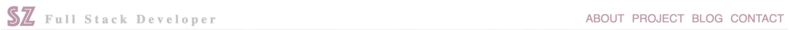
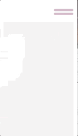
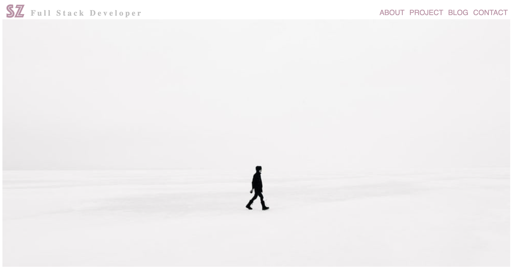
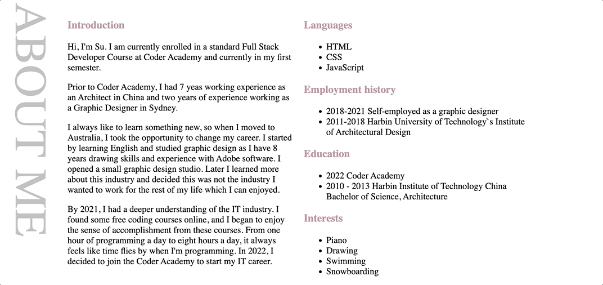
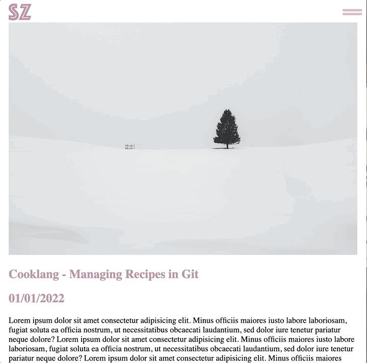

# Protfolio Website - Su Zhang

**Portfolio: [Portfolio Link](https://coderGirlSu.github.io/src)**

**Github Repo: [Github Repo Link](https://github.com/coderGirlSu/coderGirlSu.github.io)**

---

## Purpose:

Before studying IT, I was an architect and also did graphic design for one year. Without any IT background, this website can fully show potential employers what I have learned in the course, as well as my personality and skills.

---

## Functionality and Features
The majority of the site is based on a single page.
The main page is divided into 4 sections which are:
- About
- Project
- Blog
- Contact

A large heading separates each section, allowing users to quickly find the section of interest.

## Navigation
The navigation bar across the top of each page is included in all pages of the webstie. It is responsive, meaning it will adjust its size and behaviour based on the screen size.

 The logo is used as a quick return to the main page from anywhere in the site. The first time a user opens the page, an animation will be shown next to the logo.

## Hamburger Menu-Navigation

The hamburger menu displays links to the other parts of the site in a vertical list instead. When the screen size drops below 800px, such as when the website is viewed on a mobile device, the navigation bar transforms into a hamburger navigation. The menu is designed with a transparent background for enhanced design style.

## Back-to-top Navigation
The Back-to-top navigation takes users to the top of the page at any section for improved convenience. It is fixed in the bottom right corner of the website and doesn’t scroll with the rest of the site. Using `max-width:12%` to make it resposive and look good on any device screen size. This makes it accessible at any point in the site.

### Animation
Hovering over on the Back-to-top button will display a drop-shadow animation with `ease-in 0.2s`. The drop-shadow glows from grey to white and then white to grey.

## Main Image 
The main image of the site is located under the navigation bar with `width:100% ` and responsive.
The grey and pink colour combination fully balances personal character and professionalism. Conveying a sense of quiet and comfort to the user.

## About
The About layout has been designed in 2 parts via flexbox, the first part is a title which is rotated 90 degrees `text-orientation: sideways; ` on the left of the page. On the right of the page is text which desribe who am I.

### Animation
Every 5 sections the title displays fading animations  `: fading ease-in 5s ` with a grey colour when browsing which draws the user’s attention to each section as they scroll through the site.

## Project
The project section was kept simple to display the my current latest project. The laylot has been designed in 2 parts via flexbox, the first part is the horizontal title which is located above the project image. The second part is the project description which is to the left of the image. In the future, I would like to extend this to show multiple projects.

### Animation
Every 5 sections the title displays fading animations `: fading ease-in 5s ` with a pink colour. This draws the user’s attention to each section as they scroll through the site.

## Blog
One feature of the blog article component is that it can be used inside other components. The blog Article component is shown at the left of the screen, I reused it 5 times in my blog section and use flexbox to control a responsilbe layout.
The title has a vertical position that is rotated 90 degrees using `text-orientation: sideways;`.

### Animation
Every 5 sections the title displays fading animations  `: fading ease-in 5s ` using a grey colour when browsing which draws the user’s attention to the section as they scroll through the site.
Hovering over the article title or View More link will show an underline as an invitation for the user the interact and also links to the corresponding blog.

## Contact

The footer component is always shown at the bottom of every page and it is always 100% width of the screen.`width:100%`.It is made up of several parts:
- The first part is the title which uses the same styles as the project title.
- The second part is the professional contact information
- The last part is the background image of the footer section.

### Animation
Hover over the contact icon to zoom in and out and increase interaction with the user.

## Article Page

The user can navigate to all sections of the site through the navigation bar at the top of each article page.
They can also click on the logo to go back to the homepage.The article starts with an image and is followed by article title, date and the full text of the article. The footer is always shown at the bottom of the page. 

### Animation

---

## Sitemap

---

## Screenshots-Browser:
### Home

### About

### Project

### Blog

### Contact

## Screenshots-Ipad:
### Home

### About

### Project

### Blog

### Contact

## Screenshots-Iphone:
### Home

### About

### Project

### Blog

### Contact

---

## Target Audience
The audience for this portfolio are employers and developers in the technology industry. This website is a great showcase for my technical skills and personal design style so that employers can have a general understanding of my personal character and technical technical abilities.

---

## Technology Stack:
- HTML
- CSS
- Javascript
- Adobe Illustrator
- Balsamiq Wireframes
- Microsoft PowerPoint
- Github

---

## Wireframes:

### Browser

### Mobile

### Ipad

