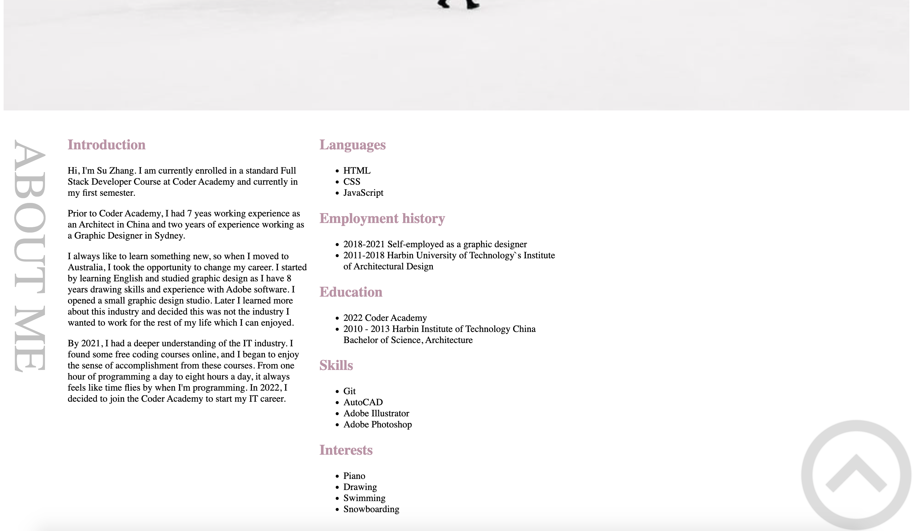
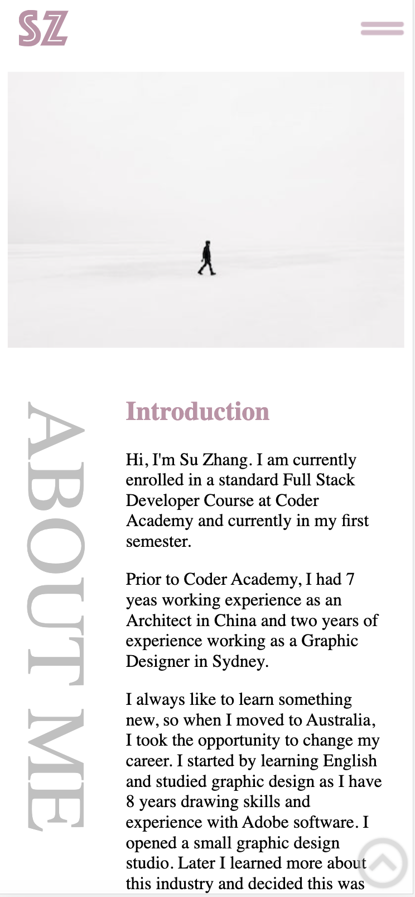
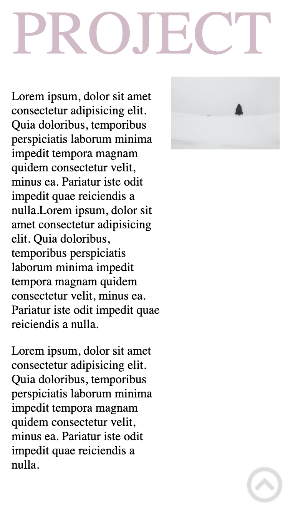
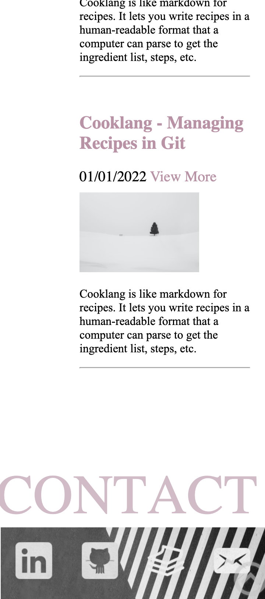

## Protfolio Website - Su Zhang

**Portfolio: [Portfolio Link](https://coderGirlSu.github.io/src)**

**Github Repo: [Github Repo Link](https://github.com/coderGirlSu/coderGirlSu.github.io)**

---

### **Purpose:**

Before studying IT, I was an architect and also did graphic design for one year. Without any IT background, this website can fully show potential employers what I have learned in the course, as well as my personality and skills.

---

### **Functionality and Features**

- **Head Components**

1.
2.

---

### **Sitemap**

---

### **Screenshots-Browser:**

#### **Home**

#### **About**

#### **Project**

#### **Blog**

#### **Contact**

### **Screenshots-Ipad:**

#### **Home**

#### **About**

#### **Project**

#### **Blog**

#### **Contact**

### **Screenshots-Iphone:**

#### **Home**

#### **About**

#### **Project**

#### **Blog**

#### **Contact**

---

### **Target Audience:**
The audience for this portfolio are employers and developers in the technology industry. This website is a great showcase for my technical skills and personal design style so that employers can have a general understanding of my personal image and technical industry.

---

### **Technology Stack:**
- HTML
- CSS
- Javascript
- Adobe Illustrator
- Balsamiq Wireframes
- Microsoft PowerPoint
- Github

---

### **Wireframes:**

#### **Browser**

#### **Mobile**

#### **Ipad**

