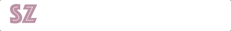
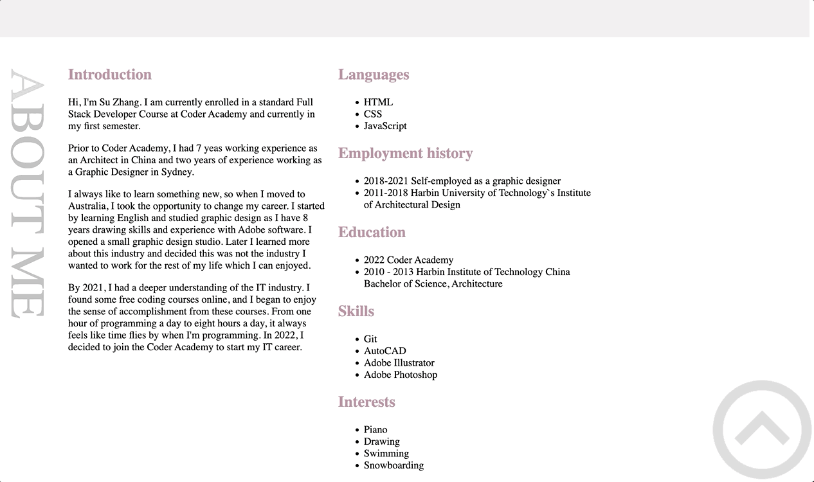
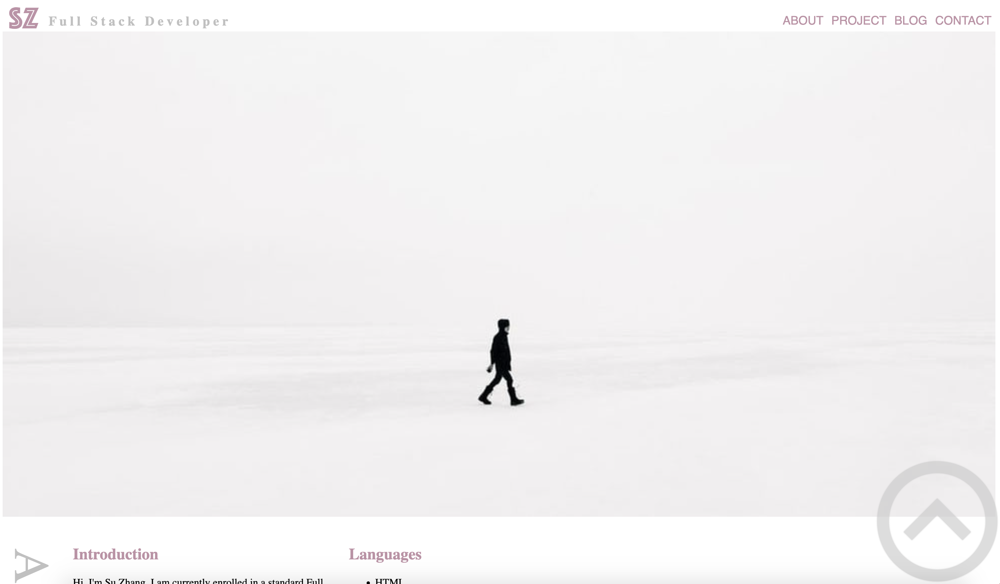
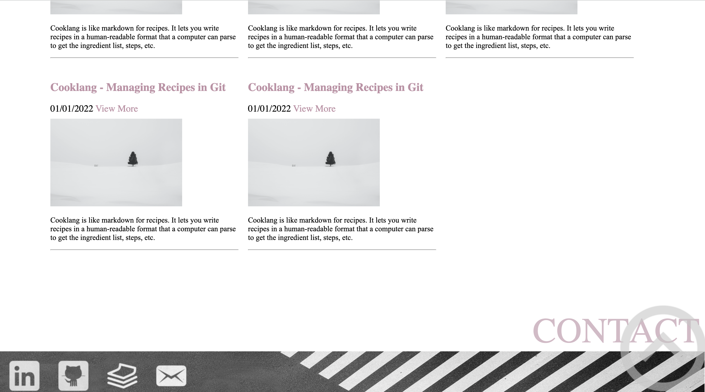
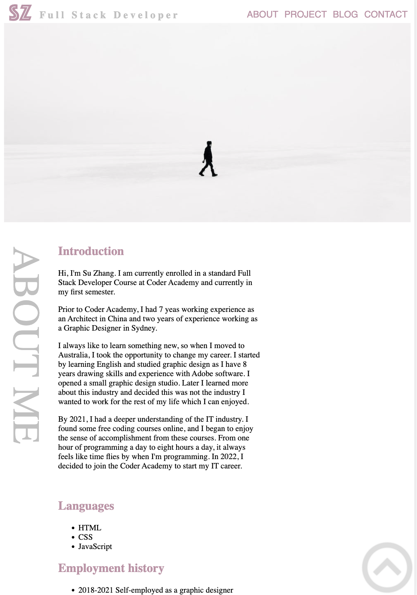
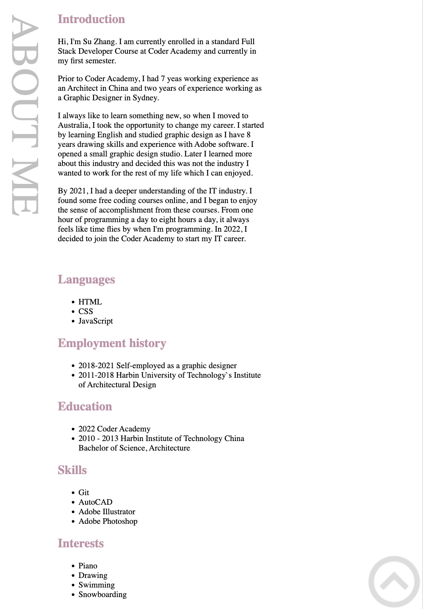
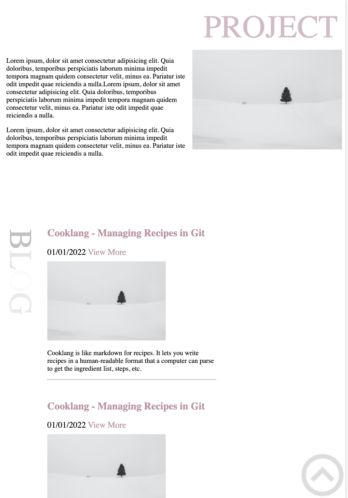
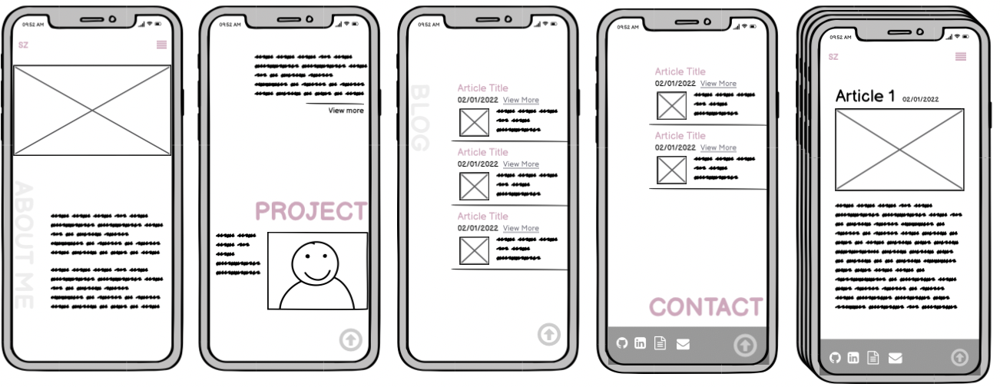
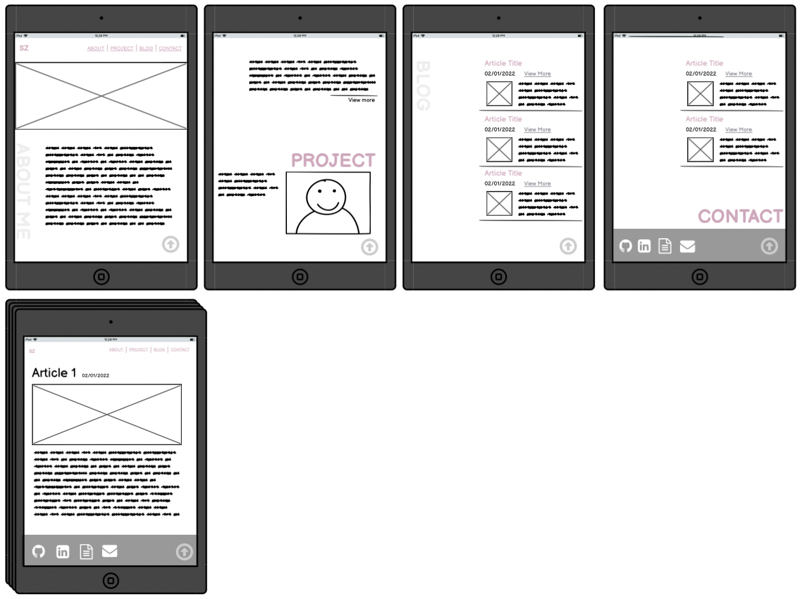

## Protfolio Website - Su Zhang

**Portfolio: [Portfolio Link](https://coderGirlSu.github.io/src)**

**Github Repo: [Github Repo Link](https://github.com/coderGirlSu/coderGirlSu.github.io)**

---

### **Purpose:**

Before studying IT, I was an architect and also did graphic design for one year. Without any IT background, this website can fully show potential employers what I have learned in the course, as well as my personality and skills.

---

### **Functionality and Features**
The majority of the site is based on a single page.
The main page is divided into 4 sections which are:
- About
- Project
- Blog
- Contact
The large heading separates each section, allowing users to quickly find the section of interest.

#### **Navigation**
The navigation bar across all pages of the webstie. It is responsive, meaning it will adjust its size and behaviour based on the screen size.

 The logo is used as a quick return to the main page from anywhere in the site. when the user first time open the page that will show a animation next to the logo.

#### **Hamburger Menu-Navigation**

The hamburger menu displays links to the other parts of the site in a vertical list instead. When the screen size drops below 800px, The navigation bar transforms into a hamburger navigation when the website is viewed on a mobile device. The menu is designed with a transparent background for enhanced design style.

#### **Back-to-top Navigation**
The Back-to-top navigation that takes users to the top of the page at any section for improved convenience.It is fixed in the bottom right corner over the website and doesn’t scroll with the rest of the site. Useing `max-wigth:12%` to make it resposive.This makes it accessible at any point in the site.

- Animation
Hover over on the Back-to-top button will display drop-shadow animation with `ease-in 0.2s`.the drop-shadow glows from grey to white clour and then white to grey

#### **Main Image**
The main image of the site which is fixed under the navigation bar with `width:100% ` and responsive.
the grey and pink colour combination fully balances personal character and professionalism. Conveying a sense of quiet and comfort to the user.

#### **About**
The About layout has been designed in 2 parts via flexbox, the first part is title which rotated 90 degrees `text-orientation: sideways; ` on the left of the site. On the right of the site is text which desribe who am I.

-Animation
Every 5 sections the title displays fading animations  `: fading ease-in 5s ` with grey colour when browsing which draws the user’s attention to each section as they scroll through the site.

#### **Project**
The project section was kept simple to display the latest project at the moment. The laylot has been designed in 2 parts via flexbox, the first part is the horizontal title where located above the project image. the second part is project description which is  on the left of the image. In the future,I would like to extend this to show multiple projects.

- Animation
Every 5 sections the title displays fading animations `: fading ease-in 5s ` with pink colour when browsing which draws the user’s attention to each section as they scroll through the site.

#### **Blog**
One feature of the blog article component is that it can be used inside other components.The blog Article component is shown at the left of the screen, I reused it 5 times in my blog section.
The title has been designed horizontal  position that rotated 90 degrees `text-orientation: sideways; ` .

- Animation
Every 5 sections the title displays fading animations  `: fading ease-in 5s ` with grey colour when browsing which draws the user’s attention to each section as they scroll through the site.
Hover over on the article title or View More link  will show underline as an invitation for the user the interact and also link to the corresponding blog.

#### **Contact**

The footer component is always shown at the bottom of every page. And it is always 100% width of the screen.`width:100%`.It is made up of several parts:The first part is the title which match the project title.
The second part is the professional contact information and the last part the background image of the footer section.
- Animation
Hover over the contact icon to zoom in and out and increase interaction with the user.

#### **Article Page**

The user can navigate to different all sections through the navigation bar at the top of each article page
They can also click on the logo to go back to the homepage.The article starts with an image and is followed by article title, date and the full text of the article.The footer is always shown at the bottom of the page. 

- Animation

---

### **Sitemap**

---

### **Screenshots-Browser:**

#### **Home**

#### **About**

#### **Project**

#### **Blog**

#### **Contact**

### **Screenshots-Ipad:**

#### **Home**

#### **About**

#### **Project**

#### **Blog**

#### **Contact**

### **Screenshots-Iphone:**

#### **Home**

#### **About**

#### **Project**

#### **Blog**

#### **Contact**

---

### **Target Audience:**
The audience for this portfolio are employers and developers in the technology industry. This website is a great showcase for my technical skills and personal design style so that employers can have a general understanding of my personal image and technical industry.

---

### **Technology Stack:**
- HTML
- CSS
- Javascript
- Adobe Illustrator
- Balsamiq Wireframes
- Microsoft PowerPoint
- Github

---

### **Wireframes:**

#### **Browser**

#### **Mobile**

#### **Ipad**

